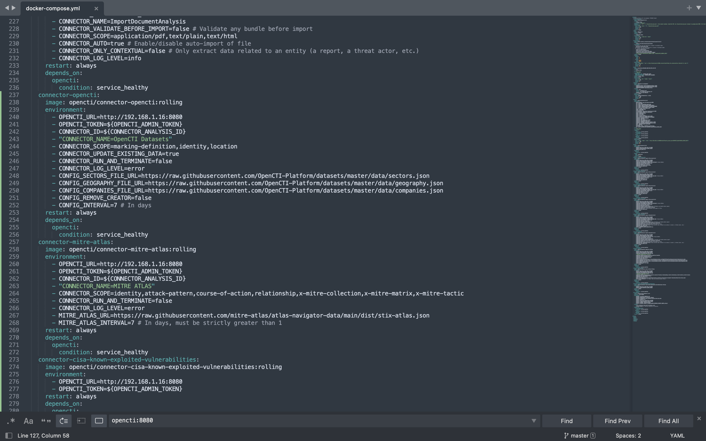
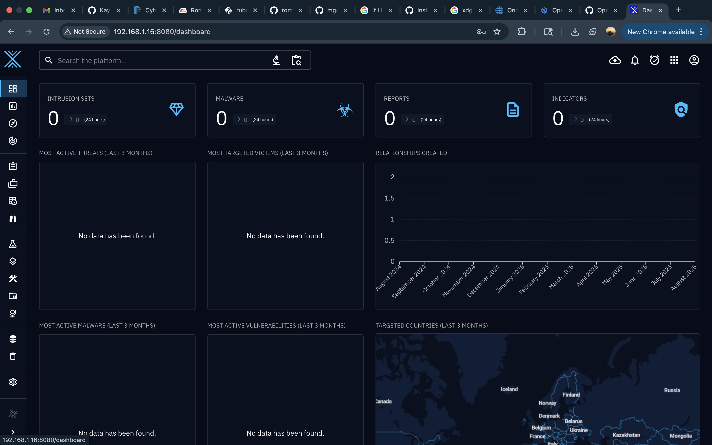
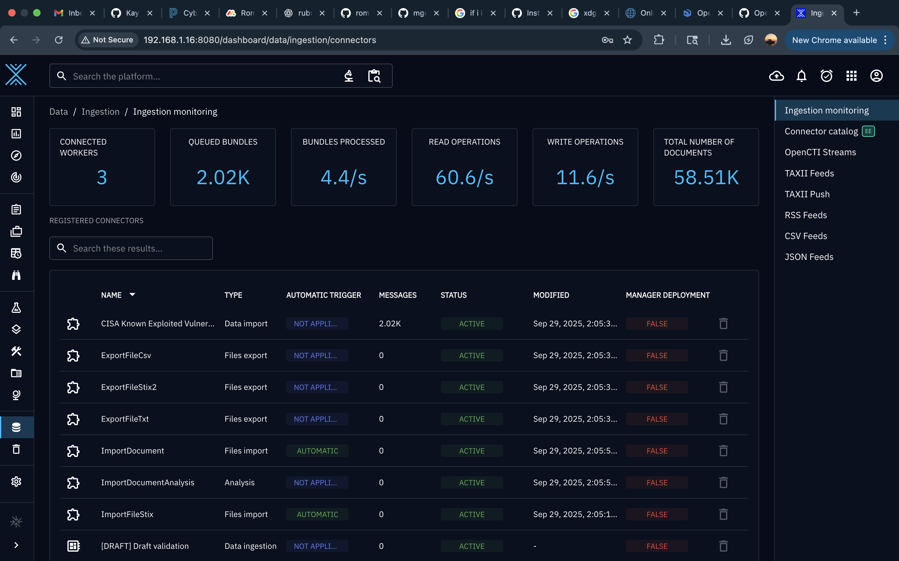
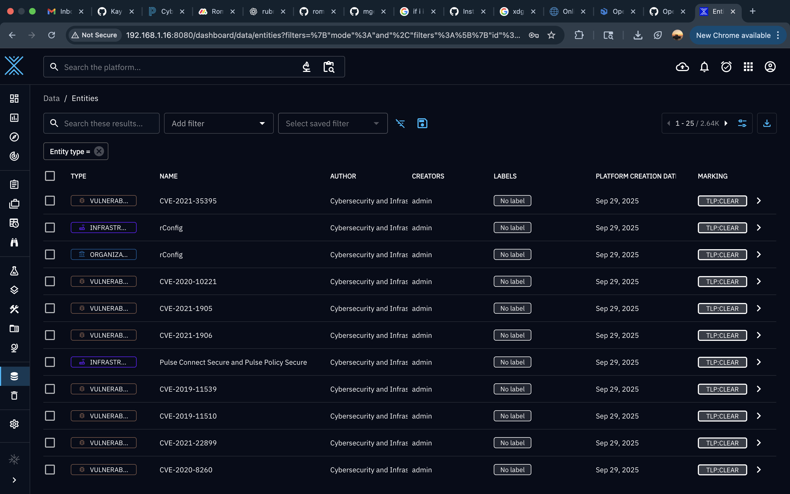

# Open CTI
For this project I downloaded Open CTI using Docker. Open CTI is a threat intelligence platform used by cybersecurity professionals to download, organize, and enrich a variety of data. I began by downloading Docker and Open CTI. After that, I added the credentials and connectors to the env file.

With that completed, I started Open CTI on my ip and opened it on my browser.

Once I confirmed Open CTI is working, I went to the ingesttion monitoring to check the status of the connectors.

With the connectors added, I can now go to the pages I added and interact with the data.

This completes the Open CTI setup and I am now able to download, run, and interact with the connectors.