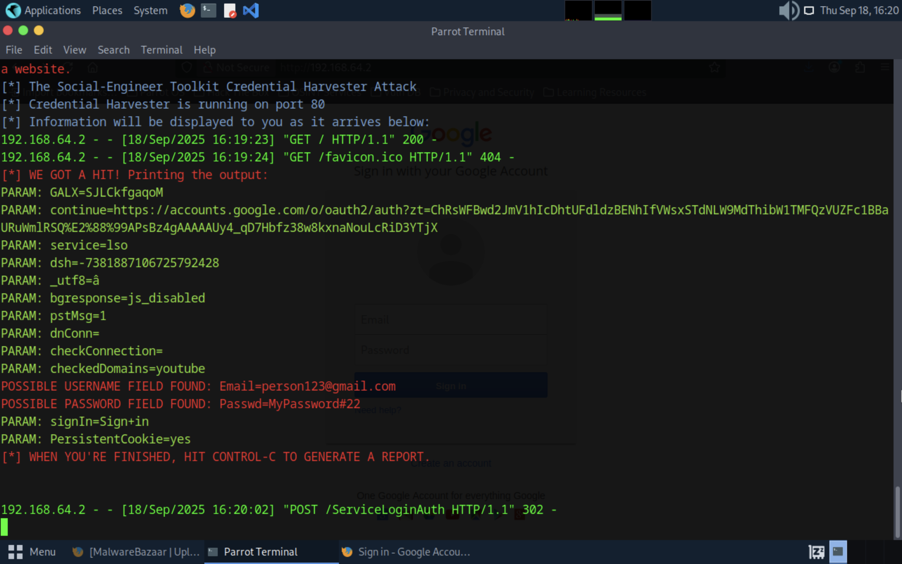

# Phishing Template - SET Toolkit

I used SET toolkit to run a Google based phishing template on my network.

I started by navigating to SET toolkit in Parrot OS, entering my ip, and starting a Google template on that ip.

After that, I navigated to the ip on my browser, and entered in my credentials.

Once I clicked enter, the SET toolkit captured the credentials, and succesfully phished the user.