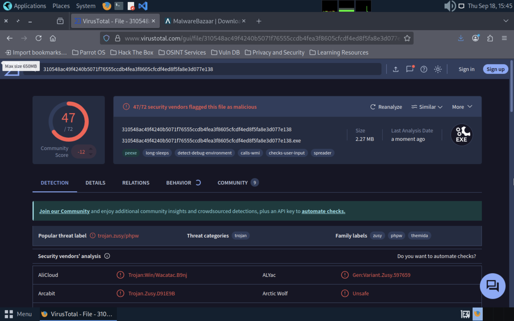
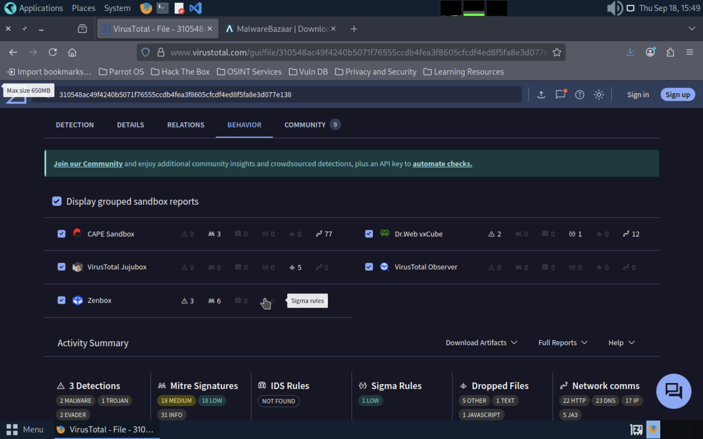

# Malware Analysis — VirusTotal Evidence

---

## Screenshot 1 — Detection Summary

VirusTotal detection overview showing the sample hash and detection ratio.

---

## Screenshot 2 — Behavior & Sandbox Reports

VirusTotal behavior tab showing grouped sandbox reports, MITRE signatures, dropped files, and network communications summary.

---

## Notes

The link to the malware I analyzed is here: https://bazaar.abuse.ch/sample/310548ac49f4240b5071f76555ccdb4fea3f8605cfcdf4ed8f5fa8e3d077e138/