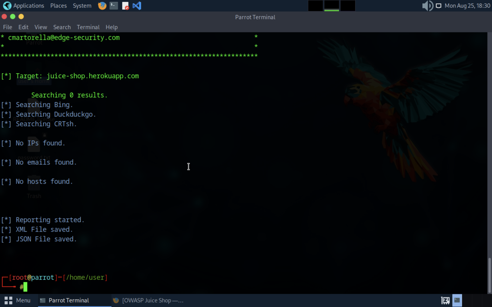
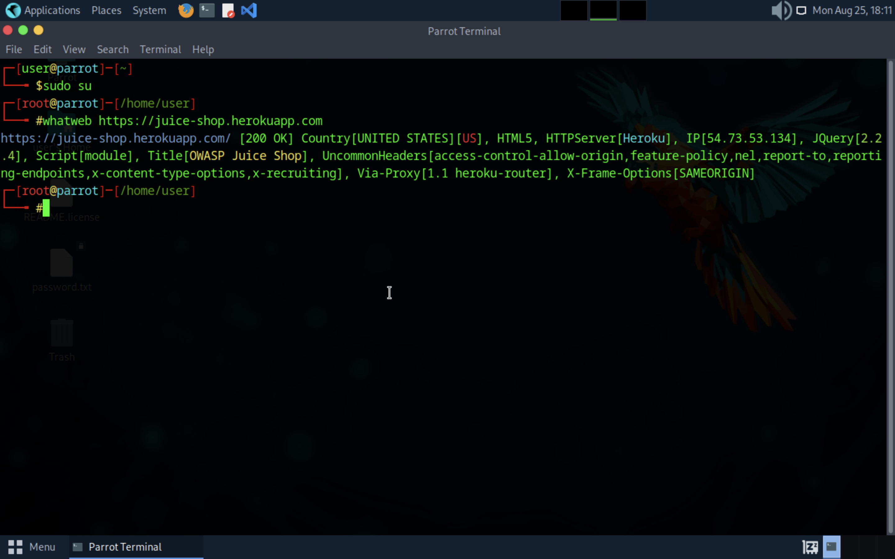
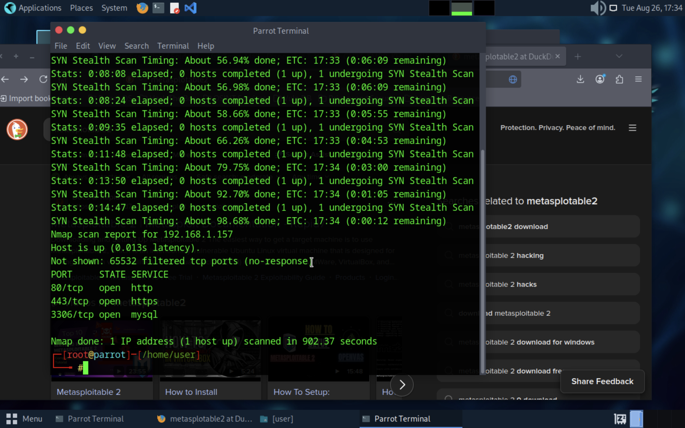
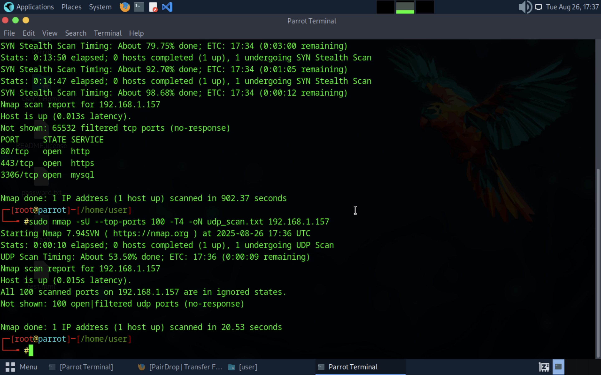
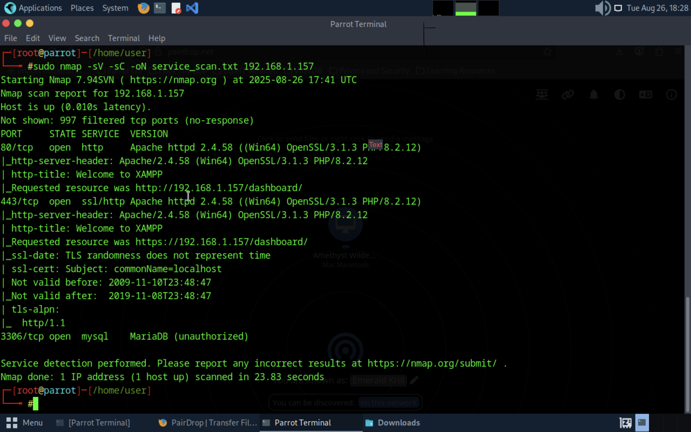
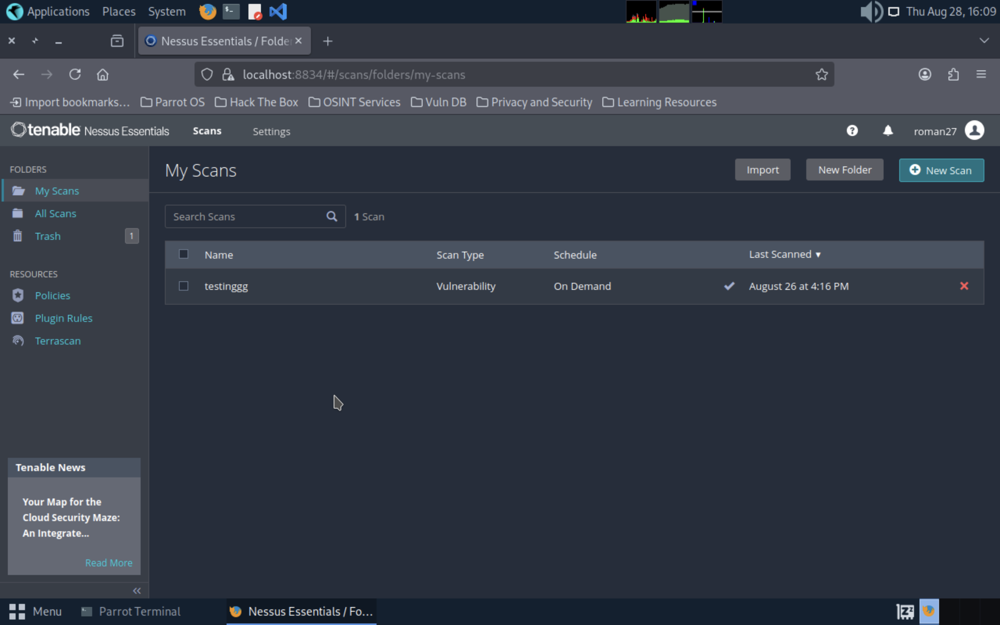
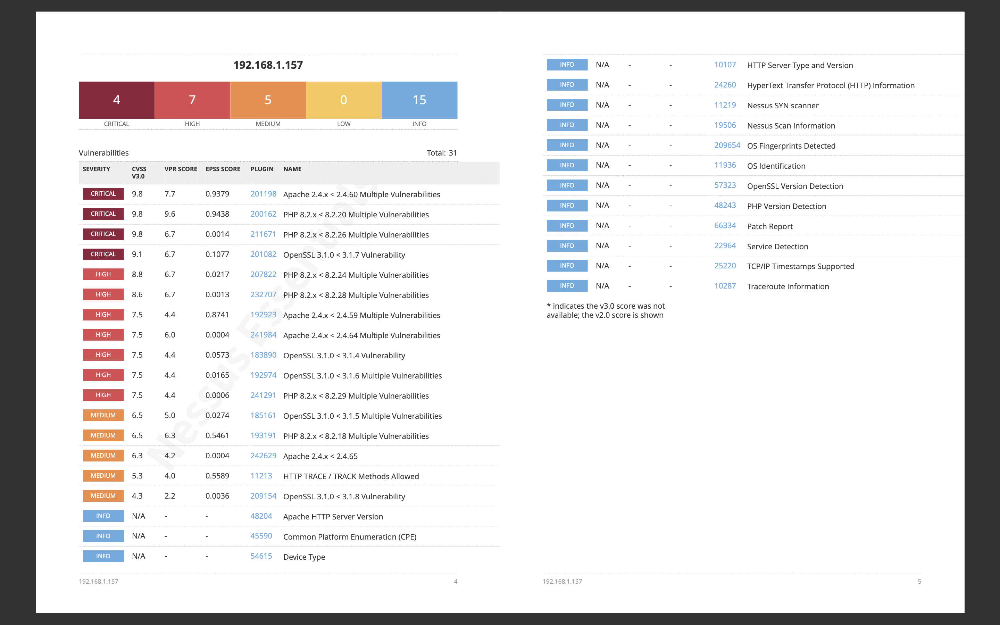

# Ethical Hacking 1
---
For ethical hacking 1 I used a variety of tools and steps in the pentesting process. The tools I used are explained below

1. **Nmap**: Nmap is a network scanner designed to discover hosts and   services on a network. it is one of the most vital tools in pentesting.

2. **Nessus**: Nessus is a vulnerability scanner that looks for security flaws and weaknesses, and then creates a report based on the findings, along with possible remediation.

3. **Wireshark**: Wireshark is an open source tool that lets you capture and inspect the data packets traveling across a network in real time.

4. **Metasploit**: Metasploit is computer security project designed to find vulnerabilities and aid in penetration testing. Its most commonly used for executing exploitation code

5. **theHarvester**: theHarvester is an open source OSINT tool designed to gather information about a target. Potential information includes, subdomains, e-mail addresses, and IP addresses.

All the tools explained above can be found in the "tools" folder

---

### Scope & Ethics
For this project, I divided my work into two safe scopes:
1. **Public OSINT** — I performed passive reconnaissance only against [OWASP Juice Shop](https://juice-shop.herokuapp.com), which is a deliberately vulnerable web application maintained for security training.
2. **Active Scanning** — All active port scans, UDP scans, and vulnerability scans were performed only against a local machine in my own network to avoid scanning unauthorized systems.

By separating OSINT from scanning, I ensured that all activities stayed within ethical boundaries and did not impact any unauthorized third parties.

--- 
### OSINT

For OSINT tools I used [OWASP Juice Shop](https://juice-shop.herokuapp.com/#/) as my target.
I ran theHarvester and Whatweb. Using Whatweb, I identified that the Juice Shop site is hosted on Heroku, runs on Node.js/Express, and uses Angular on the front end. This information helps build a technology profile of the target, which can later be used to focus vulnerability scanning on relevant services.

---
### Vulnerabilities
To find vulnerabilites I performed a tcp scan on an IP on my network. I found three open ports, 80, 443, and 3306.

Once the tcp scan was completed, I performed a udp scan and found all the ports filtered.

Finally, I ran a service scan to find what services are being ran on the ports. Both 80 and 443 were running XAMPP, and 3306 was running a form of MySQL. Port 3306 is the largest target because it is exposed to risks such as unauthorized access, exploitable vulnerabilities, and brute force attacks.

With the ports scanned, I used Nessus Essentials to find vulnerabilities within the software.

With that I found over 30 vulnerabilities, 4 of with were critical flaws in the software.

**Finding**: Nessus identified that the host is running OpenSSL version 1.0.2, which contains multiple high-severity vulnerabilities including CVE-2016-2107 (padding oracle attack).

**Risk**: Attackers could exploit these vulnerabilities to decrypt or manipulate TLS traffic, compromising confidentiality and integrity.

**Remediation**: Upgrade OpenSSL to the latest supported version (at least OpenSSL 1.1.1 or newer), disable insecure SSL/TLS protocols (SSLv2, SSLv3, TLS 1.0/1.1), and restart all dependent services. If private keys may have been exposed, reissue SSL/TLS certificates.

