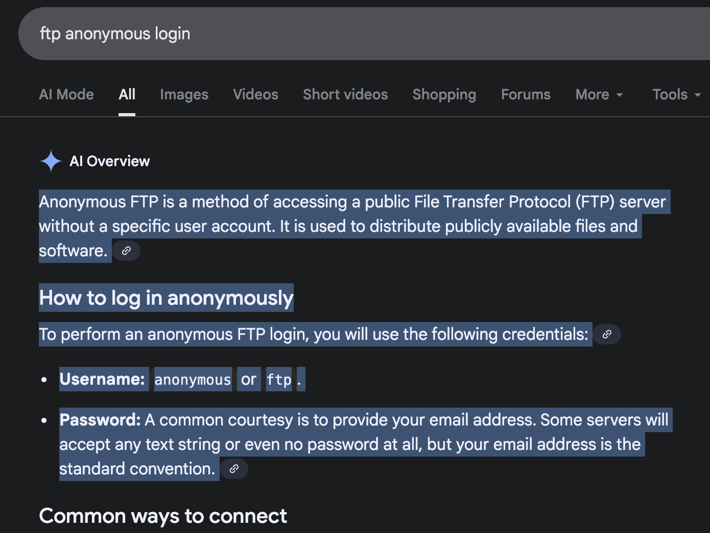

# Incident Response 1

This is the read me file for my incident response course. This file contains a step by step process on how I set up, identified, exploited, and documented a penetration test.

| Category           | Details                                                                                           |
|--------------------|---------------------------------------------------------------------------------------------------|
| Target IP          | 192.168.1.139                                                                                     |
| Testing Environment| Parrot OS (attacker), Metasploitable2 (target)                                                   |
| Type of Test       | Network Penetration Test                                                                          |
| Authorization      | Controlled lab environment, user-owned systems                                                   |
| Standards Used     | PTES methodology (Information Gathering → Exploitation → Reporting)                              |
| Tools              | Nmap, FTP client (vsftpd 2.3.4), Metasploit, Manual analysis                           |


---
 
## Step 1: Setup
I started by downloading and running Metasploitable. A Virtual Machine designed to be exploited. This will serve as my lab throught the test.

I also loaded up Parrot OS which will be serving as the attacker OS.

---

## Step 2: Information Gathering & Assessment
For this step, I gathered information on my target, and possible exploits I can perform. I started by running a host discovery scan to find the metasploitable on the network.

```
┌─[root@parrot]─[/home/user]
└──╼ #nmap -sn 192.168.1.0/24
Starting Nmap 7.94SVN ( https://nmap.org ) at 2025-10-13 17:27 UTC
Nmap scan report for 192.168.1.1
Host is up (0.0053s latency).
Nmap scan report for 192.168.1.15
Host is up (0.0014s latency).
Nmap scan report for 192.168.1.21
Host is up (0.12s latency).
Nmap scan report for 192.168.1.41
Host is up (0.095s latency).
Nmap scan report for 192.168.1.58
Host is up (0.029s latency).
Nmap scan report for 192.168.1.60
Host is up (0.16s latency).
Nmap scan report for 192.168.1.123
Host is up (0.11s latency).
Nmap scan report for 192.168.1.127
Host is up (0.014s latency).
Nmap scan report for 192.168.1.139
Host is up (0.0046s latency).
Nmap scan report for 192.168.1.143
Host is up (0.033s latency).
Nmap scan report for 192.168.1.174
Host is up (0.0092s latency).
Nmap scan report for 192.168.1.179
Host is up (0.11s latency).
Nmap scan report for 192.168.1.184
Host is up (0.011s latency).
Nmap scan report for 192.168.1.189
Host is up (0.10s latency).
Nmap scan report for 192.168.1.210
Host is up (0.097s latency).
Nmap scan report for 192.168.1.251
Host is up (0.098s latency).
Nmap done: 256 IP addresses (16 hosts up) scanned in 7.05 seconds
```
Because I already knew the location of the virtual machine, I picked it's ip out of the bunch and began the vulnerability assessment. I started by running a SYN Scan to get an idea of the possible ports and exploits.

```
┌─[root@parrot]─[/home/user]
└──╼ #nmap -sS -Pn -p- -T4 192.168.1.139
Starting Nmap 7.94SVN ( https://nmap.org ) at 2025-10-13 17:30 UTC
Stats: 0:01:24 elapsed; 0 hosts completed (1 up), 1 undergoing SYN Stealth Scan
SYN Stealth Scan Timing: About 28.19% done; ETC: 17:35 (0:03:37 remaining)
Stats: 0:03:01 elapsed; 0 hosts completed (1 up), 1 undergoing SYN Stealth Scan
SYN Stealth Scan Timing: About 40.78% done; ETC: 17:37 (0:04:24 remaining)
Stats: 0:04:36 elapsed; 0 hosts completed (1 up), 1 undergoing SYN Stealth Scan
SYN Stealth Scan Timing: About 53.10% done; ETC: 17:38 (0:04:05 remaining)
Stats: 0:07:29 elapsed; 0 hosts completed (1 up), 1 undergoing SYN Stealth Scan
SYN Stealth Scan Timing: About 75.44% done; ETC: 17:40 (0:02:26 remaining)
Stats: 0:08:28 elapsed; 0 hosts completed (1 up), 1 undergoing SYN Stealth Scan
SYN Stealth Scan Timing: About 83.05% done; ETC: 17:40 (0:01:44 remaining)
Stats: 0:09:48 elapsed; 0 hosts completed (1 up), 1 undergoing SYN Stealth Scan
SYN Stealth Scan Timing: About 93.57% done; ETC: 17:40 (0:00:40 remaining)
Nmap scan report for 192.168.1.139
Host is up (0.0013s latency).
Not shown: 65505 closed tcp ports (reset)
PORT      STATE SERVICE
21/tcp    open  ftp
22/tcp    open  ssh
23/tcp    open  telnet
25/tcp    open  smtp
53/tcp    open  domain
80/tcp    open  http
111/tcp   open  rpcbind
139/tcp   open  netbios-ssn
445/tcp   open  microsoft-ds
512/tcp   open  exec
513/tcp   open  login
514/tcp   open  shell
1099/tcp  open  rmiregistry
1524/tcp  open  ingreslock
2049/tcp  open  nfs
2121/tcp  open  ccproxy-ftp
3306/tcp  open  mysql
3632/tcp  open  distccd
5432/tcp  open  postgresql
5900/tcp  open  vnc
6000/tcp  open  X11
6667/tcp  open  irc
6697/tcp  open  ircs-u
8009/tcp  open  ajp13
8180/tcp  open  unknown
8787/tcp  open  msgsrvr
42096/tcp open  unknown
47409/tcp open  unknown
47556/tcp open  unknown
52400/tcp open  unknown

Nmap done: 1 IP address (1 host up) scanned in 648.45 seconds
```
With such a large result, I had to obtain more info. So I ran an service scan with the default settings

```
┌─[root@parrot]─[/home/user]
└──╼ #nmap -sV -sC 192.168.1.139
Starting Nmap 7.94SVN ( https://nmap.org ) at 2025-10-13 17:42 UTC
Stats: 0:00:06 elapsed; 0 hosts completed (1 up), 1 undergoing Service Scan
Service scan Timing: About 43.48% done; ETC: 17:42 (0:00:08 remaining)
Nmap scan report for 192.168.1.139
Host is up (0.00096s latency).
Not shown: 977 closed tcp ports (reset)
PORT     STATE SERVICE     VERSION
21/tcp   open  ftp         vsftpd 2.3.4
| ftp-syst: 
|   STAT: 
| FTP server status:
|      Connected to 192.168.1.15
|      Logged in as ftp
|      TYPE: ASCII
|      No session bandwidth limit
|      Session timeout in seconds is 300
|      Control connection is plain text
|      Data connections will be plain text
|      vsFTPd 2.3.4 - secure, fast, stable
|_End of status
|_ftp-anon: Anonymous FTP login allowed (FTP code 230)
22/tcp   open  ssh         OpenSSH 4.7p1 Debian 8ubuntu1 (protocol 2.0)
| ssh-hostkey: 
|   1024 60:0f:cf:e1:c0:5f:6a:74:d6:90:24:fa:c4:d5:6c:cd (DSA)
|_  2048 56:56:24:0f:21:1d:de:a7:2b:ae:61:b1:24:3d:e8:f3 (RSA)
23/tcp   open  telnet      Linux telnetd
25/tcp   open  smtp        Postfix smtpd
| sslv2: 
|   SSLv2 supported
|   ciphers: 
|     SSL2_DES_192_EDE3_CBC_WITH_MD5
|     SSL2_DES_64_CBC_WITH_MD5
|     SSL2_RC4_128_EXPORT40_WITH_MD5
|     SSL2_RC4_128_WITH_MD5
|     SSL2_RC2_128_CBC_EXPORT40_WITH_MD5
|_    SSL2_RC2_128_CBC_WITH_MD5
|_ssl-date: 2025-10-02T19:26:05+00:00; -10d22h17m44s from scanner time.
|_smtp-commands: metasploitable.localdomain, PIPELINING, SIZE 10240000, VRFY, ETRN, STARTTLS, ENHANCEDSTATUSCODES, 8BITMIME, DSN
53/tcp   open  domain      ISC BIND 9.4.2
| dns-nsid: 
|_  bind.version: 9.4.2
80/tcp   open  http        Apache httpd 2.2.8 ((Ubuntu) DAV/2)
|_http-title: Metasploitable2 - Linux
|_http-server-header: Apache/2.2.8 (Ubuntu) DAV/2
111/tcp  open  rpcbind     2 (RPC #100000)
| rpcinfo: 
|   program version    port/proto  service
|   100000  2            111/tcp   rpcbind
|   100000  2            111/udp   rpcbind
|   100003  2,3,4       2049/tcp   nfs
|   100003  2,3,4       2049/udp   nfs
|   100005  1,2,3      42081/udp   mountd
|   100005  1,2,3      47409/tcp   mountd
|   100021  1,3,4      47556/tcp   nlockmgr
|   100021  1,3,4      60247/udp   nlockmgr
|   100024  1          42096/tcp   status
|_  100024  1          55101/udp   status
139/tcp  open  netbios-ssn Samba smbd 3.X - 4.X (workgroup: WORKGROUP)
445/tcp  open  netbios-ssn Samba smbd 3.0.20-Debian (workgroup: WORKGROUP)
512/tcp  open  exec?
513/tcp  open  login       OpenBSD or Solaris rlogind
514/tcp  open  shell?
| fingerprint-strings: 
|   NULL: 
|_    Couldn't get address for your host (Romans-Air)
1099/tcp open  java-rmi    GNU Classpath grmiregistry
1524/tcp open  bindshell   Metasploitable root shell
2049/tcp open  nfs         2-4 (RPC #100003)
2121/tcp open  ftp         ProFTPD 1.3.1
3306/tcp open  mysql       MySQL 5.0.51a-3ubuntu5
| mysql-info: 
|   Protocol: 10
|   Version: 5.0.51a-3ubuntu5
|   Thread ID: 8
|   Capabilities flags: 43564
|   Some Capabilities: Support41Auth, LongColumnFlag, SupportsTransactions, SupportsCompression, ConnectWithDatabase, SwitchToSSLAfterHandshake, Speaks41ProtocolNew
|   Status: Autocommit
|_  Salt: |<Qd'/U@!!!!!#*Gi]sK
5432/tcp open  postgresql  PostgreSQL DB 8.3.0 - 8.3.7
|_ssl-date: 2025-10-02T19:26:05+00:00; -10d22h17m44s from scanner time.
5900/tcp open  vnc         VNC (protocol 3.3)
| vnc-info: 
|   Protocol version: 3.3
|   Security types: 
|_    VNC Authentication (2)
6000/tcp open  X11         (access denied)
6667/tcp open  irc         UnrealIRCd
| irc-info: 
|   users: 1
|   servers: 1
|   lusers: 1
|   lservers: 0
|   server: irc.Metasploitable.LAN
|   version: Unreal3.2.8.1. irc.Metasploitable.LAN 
|   uptime: 0 days, 0:55:02
|   source ident: nmap
|   source host: Test-77C5553E
|_  error: Closing Link: mwgqxpzou[Romans-Air] (Quit: mwgqxpzou)
8009/tcp open  ajp13       Apache Jserv (Protocol v1.3)
|_ajp-methods: Failed to get a valid response for the OPTION request
8180/tcp open  http        Apache Tomcat/Coyote JSP engine 1.1
|_http-favicon: Apache Tomcat
|_http-title: Apache Tomcat/5.5
|_http-server-header: Apache-Coyote/1.1
1 service unrecognized despite returning data. If you know the service/version, please submit the following fingerprint at https://nmap.org/cgi-bin/submit.cgi?new-service :
SF-Port514-TCP:V=7.94SVN%I=7%D=10/13%Time=68ED3A0C%P=aarch64-unknown-linux
SF:-gnu%r(NULL,31,"\x01Couldn't\x20get\x20address\x20for\x20your\x20host\x
SF:20\(Romans-Air\)\n");
Service Info: Hosts:  metasploitable.localdomain, irc.Metasploitable.LAN; OSs: Unix, Linux; CPE: cpe:/o:linux:linux_kernel

Host script results:
| smb-security-mode: 
|   account_used: <blank>
|   authentication_level: user
|   challenge_response: supported
|_  message_signing: disabled (dangerous, but default)
|_smb2-time: Protocol negotiation failed (SMB2)
|_nbstat: NetBIOS name: METASPLOITABLE, NetBIOS user: <unknown>, NetBIOS MAC: <unknown> (unknown)
| smb-os-discovery: 
|   OS: Unix (Samba 3.0.20-Debian)
|   Computer name: metasploitable
|   NetBIOS computer name: 
|   Domain name: localdomain
|   FQDN: metasploitable.localdomain
|_  System time: 2025-10-02T15:25:56-04:00
|_clock-skew: mean: -10d21h17m44s, deviation: 2h00m00s, median: -10d22h17m44s

Service detection performed. Please report any incorrect results at https://nmap.org/submit/ .
Nmap done: 1 IP address (1 host up) scanned in 74.12 seconds
┌─[root@parrot]─[/home/user]
└──╼ #

```

---

## Step 3: Exploitation

Out of all of the possible vulnerabilites, I chose the FTP server because of its simple exploitation and streamlined design. I looked up "FTP Anon" and found that when a user creates an FTP server, they need to change the default credentials. This user however, made the mistake of leaving the credentials, making it vulnerable.



With this knowledge I now can now perform the exploit.

```
┌─[✗]─[root@parrot]─[/home/user]
└──╼ #ftp 192.168.1.139
Connected to 192.168.1.139.
220 (vsFTPd 2.3.4)
Name (192.168.1.139:user): ftp
331 Please specify the password.
Password: 
230 Login successful.
Remote system type is UNIX.
Using binary mode to transfer files.
ftp> ls
229 Entering Extended Passive Mode (|||20411|).
150 Here comes the directory listing.
226 Directory send OK.
ftp> dir
229 Entering Extended Passive Mode (|||9639|).
150 Here comes the directory listing.
226 Directory send OK.
ftp> 

```
I have officially gained access to the ftp server and the users files anonymously, completing the exploit.

## Step 4: Remediation

For remediation I researched the vulnerability and compiled a report below.

### Identified Vulnerability
The vulnerability was an **Anonymous FTP Login** on the target system running **vsftpd 2.3.4**.  
This configuration allows users to connect without authentication and access the server’s files.

### Impact Assessment
If left unaddressed, this issue could:
- Allow unauthorized users to **view, modify, or upload files**.
- Be used as an entry point for **privilege escalation** or **data exfiltration**.
- Lead to **further exploitation** of the system via uploaded malicious files or information leakage.

### Recommended Remediation Steps

| Step | Action | Description |
|------|---------|-------------|
| 1 | Disable Anonymous Login | Edit `/etc/vsftpd.conf` and set `anonymous_enable=NO` |
| 2 | Enforce User Authentication | Require valid system credentials or a dedicated FTP user group. |
| 3 | Update Software | Upgrade to the latest version of **vsftpd** to patch known vulnerabilities. |
| 4 | Limit Access | Restrict FTP access using firewalls or allow only trusted IP addresses. |
| 5 | Use Encryption | Configure **FTPS (FTP over SSL/TLS)** to protect credentials and data in transit. |